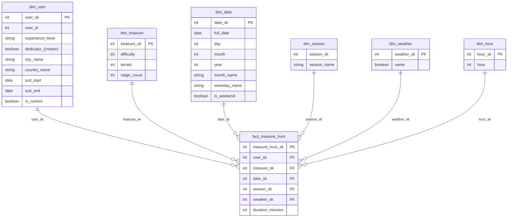

```mermaid
erDiagram
    dim_user {
        int user_sk PK
        int user_id
        string experience_level
        boolean dedicator_(creator)
        string city_name
        string country_name
        date scd_start
        date scd_end
        boolean is_current
    }

    dim_treasure {
        int treasure_sk PK
        int difficulty
        int terrain
        int stage_count
    }

    dim_date {
        int date_sk PK
        date full_date
        int day
        int month
        int year
        string month_name
        string weekday_name
        boolean is_weekend
    }

    dim_season {
        int season_sk
        string season_name
    }

    dim_weather {
        int weather_sk PK
        boolean name
    }
    
    dim_hour {
        int hour_sk PK
        int hour
    }

    fact_treasure_hunt {
        int treasure_hunt_sk PK
        int user_sk FK
        int treasure_sk FK
        int date_sk FK
        int season_sk FK
        int weather_sk FK
        int duration_minutes
    }

    dim_user ||--o{ fact_treasure_hunt: "user_sk"
    dim_treasure||--o{ fact_treasure_hunt: "treasure_sk"
    dim_date ||--o{ fact_treasure_hunt: "date_sk"
    dim_season ||--o{ fact_treasure_hunt: "season_sk"
    dim_weather ||--o{ fact_treasure_hunt: "weather_sk"
    dim_hour ||--o{ fact_treasure_hunt: "hour_sk"

```